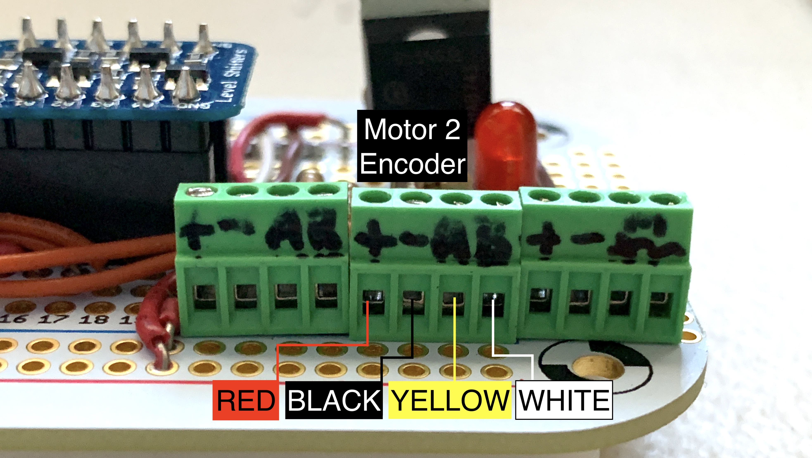

# 7s7z1s2z PCB Changes

Due to drift introduced by limitations of the RaspberryPi's ability to handle rotary encoder counting, the PCB has been heavily revised. It carries the following elements:

* **Arduino Nano** - Running code to handle encoder counting
* **5V - 3.3V level shifters** - Allows safe communication between the Raspberry Pi (3.3V) and Arduino (5V)
* **PWM controlled MOSFET Pump Motor Driver** - Circuitry that allows for software PWM control of the speed of the pump motor.
* **3x 4-contact Terminal Blocks** - Connections for the Rotary Encoders and Pump Motor.

This document will detail the key differences and the process for exchanging the old PCB with the new one.

## Old vs New

Left: Old PCB. Right: New PCB.

### Key Differences

* The `Arduino Nano` works with the voltage `Level Shifter` to communicate with the `RaspberryPi`.
	* The software running on the `RaspberryPi` maintains control over all motors, however, counting of the encoder position is done by the `Arduino Nano`.
	* Serial communication is used by the `RaspberryPi` to poll the `Arduino Nano` for the current encoder count. The `Arduino Nano` sends back the counts along that same serial connection.
	* Additionally it's possible for the `RaspberryPi` to clear the counts during calibration of the open and close positions, as when applying offsets.
	* Finally, this serial connection allows the software running on the `Arduino Nano` to be updated from the `RaspberryPi`. Changes can be made remotely over its `VPN` connection from the command line provided that the `RaspberryPi` has a working connection to the Internet.

* The location of the terminal blocks has been moved to accommodate the Arduino Nano and the level shifter.
	* Left most set of 4 connect to the `Motor 1 Encoder`: `+`,`-`,`A`,`B`
	* Middle set of 4 connect to the `Motor 2 Encoder`: `+`,`-`,`A`,`B`
	* Right most set of 4 connect to the `Pump Motor`: `+12V`,`GND`,`Pump +`,`Pump -`

## Installing the New PCB

### Preparation

* Use electrical tape or gaffer's tape to cover all soldered connections, leaving only the header pins uncovered. This will be necessary to ensure that it does not short out on any of the parts beneath it, when installed.

### Remove the Old PCB

1. Remove all attached wires from all terminal blocks by turning terminal block screws counter clockwise (CCW) until they glently click. Then gently pull wires from their terminal connections.
2. With your fingers under the left and right sides of the pcb toward its top, gently pull the PCB up and off the Motor Driver Board below it. You can see a row of soldered connections across the top, this is where the force should be applied.

### Install the New PCB

* Align the `Header Pins` of the PCB to the `Header Socket` of the `Motor Driver Board` as shown below. Be sure that every pin lines up with its socket.

* Once aligned, gently press the board into place along the top of that row of pins. Use firm pressure to ensure the board sits firmly.
* Visually inspect the space between the PCB and the components beneath it. There should be zero contact with anything beneath, especially if it is metal.
* Connect the Green and Blue Power wires from the Motor Driver Board to the Power Terminal of the PCB. Green is `-`. Blue is `+`.

* Connect the wires for the `Motor 1 Encoder` as shown below.

* Connect the wires for the `Motor 2 Encoder` as shown below.

* The `Pump Motor` now runs on a completely separate circuit. For the SFMOMA installation, a 12V 10A power supply was mounted in the ceiling and controlled using a remote controlled relay on the 120VAC connection.

### Before Powering Up

* Make sure that the wires inserted into the terminal posts have been properly trimmed and tinned so that no conductor is exposed when inserted.
* Give each wire a very gentle tug to ensure that it is secure. Using needle nose pliers is helpful.
* Test that there are no shorts between any of the terminals
	1. Using a multimeter set to `Continuity Check`, place the `black` test lead on the left most terminal screw.
	2. Press the `red` test lead to the next terminal screw to the right. Continue until you reach the end.
	3. Move the `black` test lead to the next terminal to the right.
	4. Repeat steps 2-3 until you have tested all terminals.
	5. The only places you should here beeps are:
		* Between the `+` terminals for the `Motor Encoders` 
		* Between all of the `-` terminals (2nd screws only) for each of the 3 terminal blocks
		* Between the `+` and `m+` (1st and 3rd) screws of the `Pump Motor` terminal block
	6. If you here beeps other than those described above, please take a video and send to phil@phillipstearns.com or text to 720-217-4677
* Visually inspect the space between the PCB and the components beneath it. There should be zero contact with anything beneath, especially if it is metal.