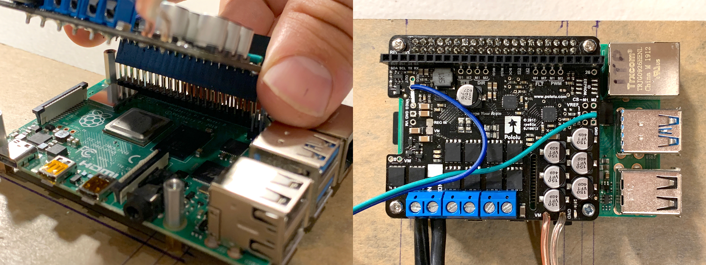
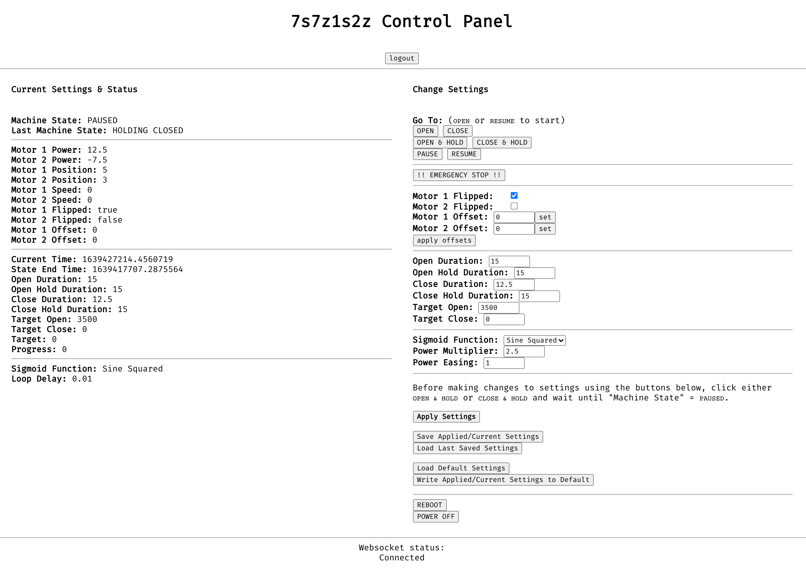

<span id="top"></span>
# 7s7z1s2z


# Installation Guide

* [Startup and Shutdown](#startup-and-shutdown) - Day to Day Operation
* [Hardware Overview](#hardware-overview) - To get familiar with the parts and terminology
* [Hardware Setup](#hardware-setup) - How everything is put together
* [Software Overview](#software-overview) - Under the hood a little
* [Using the Web Application](#using-the-web-application) - Connecting, controlling and making changes to settings
* [Troubleshooting](#troubleshooting) - Common things that might go wrong
* [Resources](#additional-resources) - Notes and other things

<span id="startup-and-shutdown"></span>
## Startup and Shutdown Procedure [(top)](#top)

### Startup

1. Obtain the sculpture address of the Operator's control panel from IT.
1. Navigate to the website using Chrome of Firefox.
1. Log in with the Operator's Credentials
1. Go through the soap changing ritual
1. Use remote to turn on Pump
1. Click `START`
1. Logout

 
### Shutdown

1. Log in with the Operator's Credentials
1. Click `STOP` at any point and wait for the sculpture to close
1. Use the remote to stop the pump.
1. Pump soap from dish.
1. Pump water into dish.
1. Use the remote to start the pump.
1. Run to flush soap
1. Use the remote to stop the pump. 
1. Logout

<span id="hardware-overview"></span>
## Hardware Overview [(top)](#top)


### Components:

* 2x [12V 29A DC power supply by Mean Well (LRS-350-12)](https://www.meanwell.com/productPdf.aspx?i=459)
* [Raspberry Pi4B Single Board Computer](https://www.raspberrypi.org/products/raspberry-pi-4-model-b/)
* [Pololu Dual G2 High-Power Motor Driver 18v22 for Raspberry Pi](https://www.pololu.com/product/3754)
* 2x [131:1 Metal Gearmotor 37Dx73L mm 12V with 64 CPR Encoder (Helical Pinion)](https://www.pololu.com/product/4756)
* Pump Motor
* Custom PCB with terminal blocks for connecting motors and PWM variable speed motor driver
* Black Acrylic Base
* Various standoffs and screws

**Note:** Motor enclosure dimensions 4.5" diameter, 5.25" length, hole 1.5"x9/32" 1.5" from the back.

* 7' cable for each 
* Grey if possible

<span id="hardware-setup"></span>
## Hardware Setup [(top)](#top)

**NOTE: Before wiring up the installation, complete these steps and proceed to the [Using the Web Application](#using-the-web-application) to test that everything is wired properly and running smoothly**


Before starting, make sure that all connection to VAC 120 mains power are disconnected.

* Mount `Power Supply` to Base
* Mount `Raspberry Pi` standoffs to base


* Insert pre-formatted `SD Card` into `Raspberry Pi`


* Mount `Raspberry Pi` to standoffs and fasten using standoffs for the `Motor Driver Shield`.


* Fit Motor `Driver Shield` on `Raspberry Pi` GPIO header pins and fasten with screws.



* Fit the Custom PCB on the `Driver Shield` taking care to align ALL header pins with ALL header holes. Press firmly in place.


* Visually inspect the space between the PCB and the components beneath it. There should be zero contact with anything beneath, especially if it is metal.

### Wiring

**NOTE: Before you begin wiring Be sure to strip, tin, and trim wires (if necessary) so that they can be cleanly inserted and secured into the terminal blocks**

1. Strip insulation off the ends
1. Twist the conductors to make a tight bundle
1. Tin conductors with solder
1. Trim conductors to ~2mm
1. Open terminal block completely with screw driver by screwing CCW (should hear/feel a slight click when end is reached) 
1. Insert tinned and trimmed wire ends into the terminal block. (Leave no conductor material exposed)
1. Close the block with screw driver by screwing CW until tight
1. Give a gentle tug to ensure the connection is secure

#### Connecting the Pump

* The `Pump Motor` now runs on a completely separate circuit. For the SFMOMA installation, a 12V 10A power supply was mounted in the ceiling and controlled using a remote controlled relay on the 120VAC connection.

### Connecting the Encoders

```
MOTOR ENCODERS (Grey 4-conductor)
----------------------------------------------
Wire Color		Function		Terminal Block
----------------------------------------------
Black			Encoder GND		PCB +
Red				Encoder +5V		PCB -
Yellow			Encoder 1		PCB A
White			Encoder 2		PCB B
```

* Connect `Green (-)` and `Blue (+)` wires from the `Driver Shield` to the corresponding 2-connection `Terminal Block`. Screw tight with precision flat head screw driver and tug gently to ensure they're secure.


* Connect the wires for the `Motor 1 Encoder` as shown below.


* Connect the wires for the `Motor 2 Encoder` as shown below.


**NOTE:** 

* **Ensure that the top PCB is seated properly in the header socket below by gently pressing down along the top edge. Do this after making any adjustments to the wiring or (re)positioning of the board**
* **Visually inspect the space between the PCB and the components beneath it. There should be zero contact with anything beneath, especially if it is metal.**
* **Visually inspect each terminal block connection to ensure that there are no exposed conductors, frayed wires, anything that might cause a short.**
* **Check terminal block connections using needle nose pliers, give each wire a gentle tug to ensure that is firmly secure**

#### Connecting the Power

```
MOTOR POWER (for each motor)
----------------------------------------------
Wire Color		Function		Terminal Block
----------------------------------------------
Red				Motor +V		Motor Driver +
Black			Motor GND		Motor Driver -
```


12. Connect ~120 VAC power to the `Power Supply` using the following chart:

```
~120 VAC Wire Color Code:
==============================================
Color			Function	Terminal Block
----------------------------------------------
Black			Line		L
White			Neutral		N
Green			Ground		GND (symbol)
```


1. **Double check that ALL connections are correct!**
2. Connect the power supply to mains power when ready to proceed to testing and configuration.

<span id="software-overview"></span>
## Software Overview [(top)](#top)

### Components

* Debian Linux RaspiOS - `Linux 7s7z1s2z 5.10.17-v7l+ #1421 SMP Thu May 27 14:00:13 BST 2021 armv7l GNU/Linux`
* Wireguard VPN Client
* Main 7s7z1s2z `server.py` script
	* Configuration files
	* `MotorControl` python class defined in `motor_control.py`
		* `Encoders` class defined in `encoders_serial.py`
	* Tornado Web Application
		* Assets located in `static/` and `template/` directories
* Install and uninstall bash scripts.
* `systemd` unit descriptor for `7s7z1s2z.service`
* `systemd` unit descriptor for `7s7z1s2z_shutdown.service`
* There is an automated configuration script setup using Ansible in the event that setting up replacement or test environments is necessary. Documentation on that forthcoming.
* Although hardware, the Arduino Nano is running software that is used to count and decode the rotary encoders to provide position data via Serial to the Raspberry Pi.

### Python Dependencies

* Python3.7
* packages: `python3-pigpio`, `python3-tornado`, `python3-serial`, `python3-serial-asyncio`
* drivers: [https://github.com/pololu/dual-g2-high-power-motor-driver-rpi](https://github.com/pololu/dual-g2-high-power-motor-driver-rpi)

### RaspiOS

* Web Application is located at `https://7s7z1s2z.local` when accessing from the same network. Does not need the internet to run, but internet is required for remote management.
* Wireguard VPN permits secure remote access as long as the Raspberry Pi is connected to the internet.
* Password Login is Enabled for `ssh` user `membrane`
* `ssh` login by key is also possible locally and remotely
* `systemd` is used to manage the startup and shutdown of the software running the sculpture via `7s7z1s2z.service`.
* `7s7z1s2z_shutdown.service` is meant to provide a clean stop in the event that a system shutdown command is issued.

### Wireguard VPN

* Used to create an encrypted tunnel for remote access. Requires that my Virtual Private Server is up and that the Wireguard VPN Server is running.
* VPN IP Address: `10.42.0.100`
* Custom `wg_setup.sh` scripts used by `wg_setup@.service` to manage VPN interface. Configuration and environment files are located in `/etc/wireguard/`

### Main `server.py` Script

* Executed by `7s7z1s2z.service` at boot.
* Creates and instance of `MotorController` and `Tornado Web Application` server. 
* The HTTP(S) server is managed by Tornado's IOLoop.
* The `MotorController` instance runs in a separate thread. Full asynchronous management `asyncio` is a place where the code and be optimized in the future.

### MotorController Class

Provides all the resources necessary to control the main gear head motors and the pump motor

* dependencies: Custom `Encoders` class from `encoders_serial.py`, and `dual_g2_hpmd_rpi` module provided by Pololu.
* Runs in a thread separate from the main `server.py` thread.
* Asynchronously handles WebSocket messages

### Encoders

#### `encoders_serial.py`

This class handles communication between the RPi and the Arduino over Serial in an asynchronous manner. Values can be accessed safely by synchronous code.

* Subclasses threading.Thread
* Has its own asyncio event loop
* Reads and writes serial to the Arduino Nano to obtain and clear encoder counts.

#### `encoders-half-count.ino`

Software that uses interrupts to count encoders and serial to communicate the count and clear the count on any data received

* Uses external interrupts `INT0` and `INT1` on pins D2 and D3 respectively. These detect changes on the A pin of each encoder.
* ISRs manually enabled and defined rather than using `attachInterrupt()`
* Serial is sent and buffers checked every 10ms.
	* The output format is `<encoder1Count>|<encoder2Count>\r\n`
	* Any character received by the Arduino will clear the counts. Only a single `\n` character should be necessary to clear.

### Tornado Web Application

* Requires authentication!
	* There are separate accounts setup for Operation and Calibration
	* Operators should not be allowed to access Calibration unless properly trained.
* Requires the javascript be enabled
* Uses self-signed SSL certificates to achieve a secure encrypted HTTPS connection, which may cause mobile devices to reject attempts to create a web socket connection.
* Uses WebSockets to pass data between the browser and the application
* Displays current status, updated every second
* Displays WebSocket connection status
* Interface for changing the state of the sculpture, updating parameters/settings with session store/recall/apply, and load/write defaults.
* Components:
	* `static/favicon.ico` - cute icon for the browser tab
	* `templates/login.html` - login page
	* `templates/calibration.html` - calibration control panel page
	* `templates/operation.html` - operator's control panel page
	* `static/jquery-3.5.1.min.js` - simplified javascript access/control of DOM elements
	* `static/style.css` - CSS styling of elements
	* `static/calibration.js` - WebSocket handing for calibration.html
	* `static/operation.js` - WebSocket handing for operation.html
	* `static/Fira_Mono/` - font
* Sets routes for about resources.
* Defines which actions to be handled and how.
* Creates and manages the `MotorController` instance.

### Management Scripts

* `install.sh` - use for fresh install
* `uninstall.sh` - removes all install components

<span id="using-the-web-application"></span>
## Using the Web Application [(top)](#top)

* [Connecting](#connect)
* [Login](#login)
* [Control Panel](#control-panel)
	* [Current Status](#current-status)
	* [Change Settings](#change-settings)
	* [Saving and Loading Settings](#saving-and-loading-settings)

<span id="connect"></span>
### Connecting

1. Ethernet connection can be used to access the device locally. Simply connect an ethernet cable between the Raspberry Pi 4 and your device (laptop/desktop required). This method is recommended when setting up for the first time.
2. Ethernet should be used to connect to the museum network. Ensure that the ethernet connection is on the same subnet as the WiFi network OR is given an IP address that is accessible from the museum WiFi (non-public/staff only).
3. WiFi can be configured to connect to the museum WiFi network. In which case, stuff wishing to access the device must be connected to the same network.

<span id="login"></span>
### Login

* Navigate to `https://7s7z1s2z.local`


* You will likely see a warning from your browser that the certificate is invalid. Make an exception to access the page using the options provided by your browser.


* Login is required. Sessions expire after 1 day.
* Failed login returns to the login page, no status is displayed.
* Successful login loads the `Control Panel`.

<span id="control-panel"></span>
### Operator's Panel


* `START` will open the sculpture and run the open/close routine until stopped. It can be pressed at any moment.
* `STOP` will close the sculpture and pause it. It can be pressed at any moment.
* `!!EMERGENCY STOP!!` is to be pressed in the event the motor movement will cause injury or harm to visitors or the sculpture itself. If pressed, contact Phillip Stearns. Assessment of why it was necessary to use this feature will have to be done to determine whether it's safe to continue.

### Control Panel (Calibration)



* `Current Settings & Status` - This section relies on websockets to poll and update the values seen here. They are a reflection of the current parameters governing the behaviors of the installation.
* `Change Settings` section relies on websockets to push values entered here to the installation.
* `logout` ends the session and requires the user to log back in again. Sessions are valid only for 24 hours. Logging out at the end of each session is highly recommended to ensure security for the safety of the sculpture and visitors.
*  `Websocket status:` indicates whether the sculpture is connected to the `7s7z1s2z Control Panel` web page. `Current Status` and `Change Settings` require the status to be `Connected`


<span id="current-status"></span>
#### Current Status

Displays the current status of the sculpture and the settings currently running.

* `Machine State` and `Last Machine State`:
	* `STOPPED` - Indicates that the `!! EMERGENCY STOP !!` has been pushed.
	* `STARTUP` - Indicates whether the control program has just been started.
	* `OPENING` - Sculpture is in the process of opening.
	* `HOLDING OPEN` - Sculpture is open and holding open.
	* `CLOSING` - Sculpture is in the process of closing.
	* `HOLDING CLOSE` - Sculpture is closed and holding closed.
	* `PAUSED` - Sculpture movement has been suspended by the user.
	* Notes: Machine State is the CURRENT state and Last State was the state the sculpture was in when the user pressed `PAUSE` or `STOP`. States progress in order with OPENING following the completion of HOLDING CLOSED.
* `Motor Power`: Value applied to the Driver Shield, min/max range -480/480. (float)
* `Motor Position`: Encoder event count. 8400/rev (int)
* `Motor Speed`: Encoder Events / Loop Delay
* `Motor Flipped`: Whether the motor direction is reversed (boolean)
* `Motor Offset`: Offset Motor Position by N counts (int)
* `Current Time`: seconds since linux epoch (float)
* `State End Time`: time when the current machineState should complete (float)
* `Durations`: time in seconds for how long each machine state should take to complete. (float)
	* `Startup Duration`: How long the pump is given a chance to coat the cables in liquid soap.
	* `Open Duration`: amount of time it takes to move from CLOSED to OPEN.
	* `Open Hold Duration`: amount of time to hold the sculpture open (HOLDING OPEN).
	* `Close Duration`: amount of time it takes to move from OPEN to CLOSED.
	* `Close Hold Duration`: amount of time to hold the sculpture closed (HOLDING CLOSED).
* `Target Open`: Open position expressed as encoder event counts (int)
* `Target Close`: Closed position expressed as encoder event counts (int)
*  `Target`: The position the motors are aiming for. This changes based on the progression through each machine state.
*  `Progress`: 0.0 = closed, 1.0 = open
*  `Sigmoid Function`: The currently selected motion smoothing function.
*  `Loop Delay`: Interval between triggering of the main `MotorController` `motionControl` method. (float)

<span id="change-settings"></span>
#### Change Settings

* `Go To:` - Clicking buttons immediately change the state of the sculpture. Totally safe to do whenever. 
	* `OPEN`: opens the sculpture. keeps running without pause. (can be used to start the installation)
	* `CLOSE`: closes the sculpture keeps running without pause.
	* `OPEN & HOLD`: opens the sculpture then pauses.
	* `CLOSE & HOLD`: closes the sculpture then pauses.
	* `PAUSE`: pauses progress in any state. 
	* `RESUME`: resumes progress of the `PAUSED` or `STOPPED` (can be used to start the installation).

* `!! EMERGENCY STOP !!`
	* Issues a command to the MotorController to set motor power to 0.0 and the pump power to 0.0 (hard pause)
	* Can be exited by clicking `RESUME` only.
	* **NOTE: This feature was put in place in the event that the motors begin to spin erratically. It may not work under certain circumstances and power may need to be disconnected. It's recommended to have the sculpture on a dedicated breaker or switch that is easily accessible.**

***

Changes to the settings below cannot be performed when the installation is moving. Best practice is to click either `OPEN & HOLD` or `CLOSE & HOLD` and wait for the "Machine State" to reach `PAUSED`.

**Note: It is possible to edit the parameters below without applying.**

* `Motor Flipped` - checkbox to flip the direction of each motor (boolean)
* `Motor Offset` - number input to set the offset values for each motor (int)
	* Use `set` buttons to push the values to the sculpture (`Apply Settings` no longer works here)
	* Use `apply offsets` when the offsets achieve the desired balance between sides
* `Durations` - number inputs to set the durations for each state (int). Cannot be negative!!!
* `Targets` - number inputs to set the OPEN and CLOSE positions (int)
* `Sigmoid Function` - select input to choose a motion smoothing algorithm. Controls the easing of the motor out of closed and into open positions.
* `Power Multiplier` - Power is determined by distance from target. Multiplier scales the effect of being off target. 1 peans there is a 1:1 distance to power relationship. Increase if motors hesitate 
* `Power Easing` - gradually applies power changes based on this percentage. 1.0 for no easing. lowest recommended easing value is 0.125. If the powers are over shooting, reduce value. If the motors are pulsing, increased value.
* `Power Limit` - hard limits the power sent to the motors. Increase only if motors are struggling. 480 is the max.
* `Loop Delay`- controls the timing of the `MotionController` `motionControl` loop. Adjust to smaller value if motion stutters in a rapid pulse or is jerky/jittery. Adjust upwards to free up system resources. Ideally this should not need to be changed.

* Click `Apply Settings` to push the above settings to the sculpture

<span id="saving-and-loading-settings"></span>
#### Saving and Loading Settings

* `Apply Settings`:
	* Pushes values in `Change Settings` fields to the `MotorController`, which should translate over to the `Current Status`
* `Save Applied/Current Settings`:
	* Temporarily saves the current settings running on the `MotorController` to be recalled later in the same session.
* `Load Last Saved Settings`:
	* Loads the previously saved settings from the current session into the `Change Settings` fields. Click `Apply Settings` to push to the `MotorController`. Think of the above two steps as a multi-step undo.
* `Load Default Settings`:
	* Loads the `Default Settings` from disk into the `Change Settings` fields. Click `Apply Settings` to push to the `MotorController`.
* `Write Applied/Current Settings to Default`: 
	* Writes the current applied settings running on the `Motor Controller` to disk. The sculpture will use these settings when it is restarted.
	* **NOTE: Make sure that motor offsets have been applied and are zeroed out in the "Current Settings & Status" column.**

<span id="troubleshooting"></span>
## Troubleshooting [(top)](#top)

### 1. Motors spin erratically

1. Stop the installation immediately.
	* If the remote is not available to power off, then do so from the control panel.
	* Contact Phillip Stearns immediately.
2. Likely causes:
	* Encoder wires have become disconnected
		* Check the motor connector
		* Check the PCB terminal block connections
	* Someone/thing has pulled hard on the counter weight, causing the motor to break its position lock.
		* Power off everything, reset to zero, power on.

### 2. Pump motor doesn't spin

1. The Pump is on a remote controlled outlet.
	* Visually confirm that the outlet switch indicates that it has power and is on (red light) and is responding to button presses.
	* Check that the power supply (installed in the ceiling) is powering up and outputs 12V DC with the motor disconnected from the supply.
	* Connect the motor to the 12V DC terminals.
		* If arcing occurs but no pump movement
			1. there may be a short somewhere
			2. the pump may be clogged and preventing the motor from turning
			3. the motor may have failed
	* Check the terminals of the pump motor
		* If 12V DC can be measured at the terminals but no movement is observed
			* Check the pump for blockage
			* The motor may have failed

<span id="additional-resources"></span>
## Additional Resources [(top)](#top)

### Pololu Dual G2 High-Power Motor Driver 18v22

Previous version of this piece used an arduino mega. Code was written in C++ for Arduino using the standard IDE. This version of the piece will use a raspberry pi to control the motors.

#### Resources:

* [Python library for the Pololu Dual G2 High-Power Motor Drivers for Raspberry Pi](https://github.com/pololu/dual-g2-high-power-motor-driver-rpi)

#### Process:

1. Install pigpiod: `sudo apt install python3-pigpio python-pigpio`
1. Enable `pigpiod` daemon: `sudo systemctl enable pigpiod`
1. Start the `pigpiod` service: `sudo systemctl start pigpiod`
1. Clone the Pololu driver repo: `git clone https://github.com/pololu/dual-g2-high-power-motor-driver-rpi`
1. Change into the cloned repo directory: `cd dual-g2-high-power-motor-driver-rpi`
1. Run the install script: `sudo python setup.py install